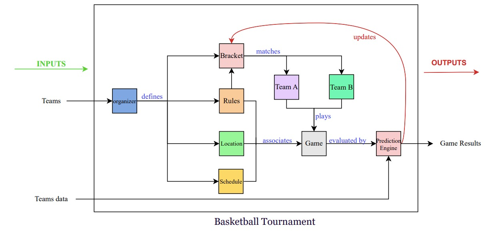

# WORKSHOP #1
## 🏀 Collegiate basketball tournaments
The selected competition, March Machine Learning Mania 2025, focuses on predicting the outcomes of the NCAA men’s and women’s basketball tournaments using historical data. Participants submit predicted win probabilities, which are evaluated using the Brier score. Each person can submit up to two entries.  
To learn more about this competition -> [Kaggle - March Machine Learning Mania 2025](https://www.kaggle.com/competitions/march-machine-learning-mania-2025/data)

## 📝 Systemic Analysis
Given the context of the March Machine Learning Mania 2025 competition, a systemic analysis was conducted to better understand the structure and dynamics of a collegiate basketball tournament. This included identifying the main components of the system—such as teams, games, schedules, organizers, and results—as well as their interactions and feedback loops.   

The analysis focused on modeling the tournament as a complex system, exploring its inputs, processes, outputs, and the potential influence of unpredictable factors such as referee decisions or player injuries. By mapping out these relationships, we aimed to highlight the tournament’s sensitivity to internal and external variations, as well as the chaotic elements that make the final outcomes difficult to predict. 
📍[View full analysis](workshop1_report_.pdf)
