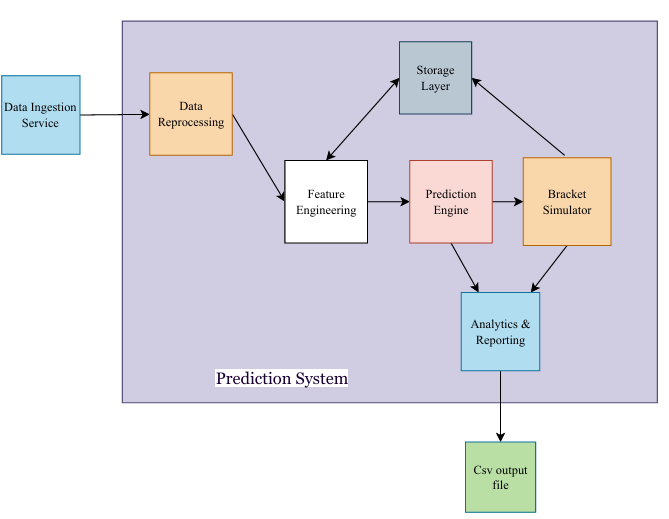

# 🧩 KAGGLE SYSTEMS DESIGN 🧩
This time, workshop #2 was developed with a robust system design approach, all of this, from what was developed in workshop #1. By doing a more detailed analysis of the system, we extracted some important requirements of the system, for its correct operation, also to be clear about what is needed and how to build it.  
In terms of tools, we proposed the use of Python with libraries such as pandas for data management, scikit-learn for modeling and normalization, and itertools for efficient generation of clashes. The “Abstract Factory” design pattern was also applied to build a bracket adaptable to changes in the number of teams.  

## 📝 Architecture
The system architecture was designed with a modular structure. Specific components were designed for data loading, cleaning and normalization, feature engineering, predictive modeling with logistic regression, tournament bracket simulation and results export. Each module has a single responsibility to facilitate future modifications, following system engineering principles such as modularity, traceability and scalability.   

## 
The full report details the findings, architectural decisions, constraints and proposed tools. This document provides a solid foundation for upcoming workshops.  
📍[View full system design document](SystemDesignDocument.pdf)
